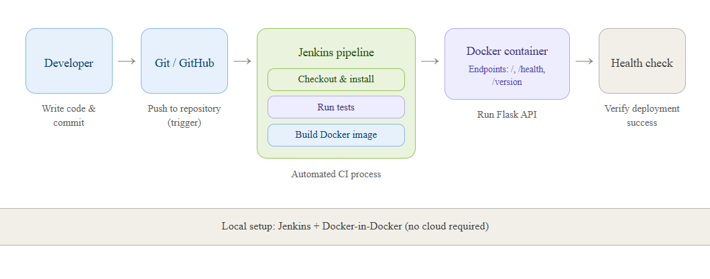

# Flow-API

**Automated Python API Deployment Pipeline**

A lightweight Flask API demonstrating a complete CI/CD workflow using Git, Jenkins, and Docker. The focus is not on the application logic, but on the **automation infrastructure** surrounding it.

> **Status:** ✅ Tested locally. API verified via Python and Docker.

## 🚀 Quick Start

```bash
# Run locally
pip install -r requirements.txt
python -m app.main

# Run with Docker
docker build -t flow-api .
docker run -d -p 5000:5000 flow-api

# View live documentation
http://localhost:5000/about
```

## 🏗️ Architecture



| Component | Tool | Purpose |
|-----------|------|---------|
| Application | Flask | REST API with /, /health, /version |
| Version Control | Git + GitHub | Track changes, trigger pipeline |
| CI/CD | Jenkins | Automate build, test, deploy |
| Containerization | Docker | Consistent runtime environment |
| Testing | pytest | Validate API before building |
| Documentation | /about endpoint | Live in-app documentation |

## 🧪 Testing

```bash
python -m pytest tests/ -v
```

3 tests pass: index, health, version endpoints.

## 🧠 Engineering Decisions

| Decision | Why |
|----------|-----|
| **Why Flask?** | Lightweight framework — lets us focus on the pipeline, not the app logic |
| **Why Docker?** | Eliminates environment drift between dev, CI, and deploy |
| **Why Jenkins?** | Pipeline-as-code makes automation transparent and version-controlled |
| **Why pytest?** | Fast feedback loop — catches bugs before building an image |
| **Why Gunicorn?** | Production-grade WSGI server, not Flask's dev server |
| **Why local-only?** | Master the mechanics of CI/CD before abstracting to cloud |

## 🐛 Failure Log & Debugging

### Issue 1: Jenkins cannot run `docker build`
- **Symptom:** `Permission denied: /var/run/docker.sock`
- **Cause:** Jenkins container had no access to the host Docker daemon
- **Fix:** Mounted the Docker socket and set permissions

### Issue 2: Health check fails immediately after deploy
- **Symptom:** `curl: (7) Failed to connect`
- **Cause:** Container was still starting when Jenkins ran the check
- **Fix:** Added `sleep 3` before the health check stage in Jenkinsfile

### Issue 3: Docker image tag collisions
- **Symptom:** Old container not replaced, stale version running
- **Cause:** Same tag used across builds
- **Fix:** Used ${BUILD_NUMBER} as unique image tag

## 📚 Documentation

Visit the live documentation endpoint:
```
GET /about
```

## 📄 License

MIT License — free to use, learn from, and modify.
